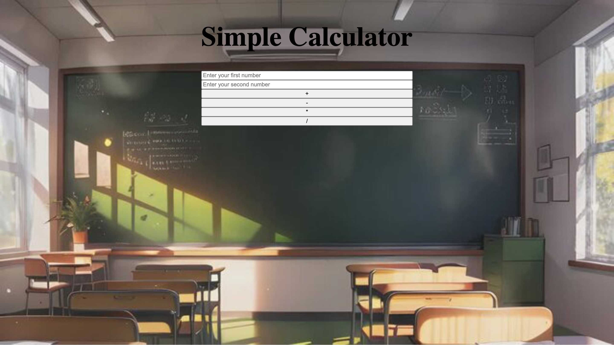

# Simple Calculator
- Calculator to help you Add, Subtract, Multiply, and Divide!

- Buttons help you to conduct different operations.



### Tech Used:

- HTML
- CSS
- Javascript

### Lessons Learned

- The use of different Math functions
- Working with DOM elements
- The use of conditional statements

### Review
```
I completed the challenge: 5
I feel good about my code: 5
Open for any feedback.
```